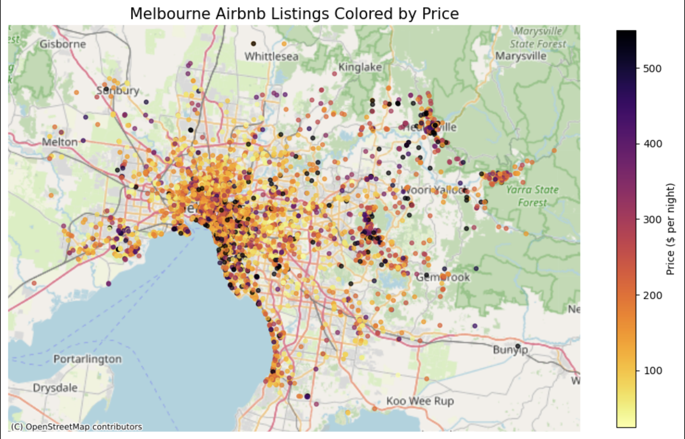

# 🏡 Predictive Analytics: Airbnb Pricing in Melbourne
### ⭐ *1st Place — BUSA8001 Predictive Analytics Competition (105 Teams)*
[](Acknowledgment_Letter.pdf)

## 📌 Project Overview

This project develops a production-grade machine learning pipeline to predict Airbnb rental prices in Melbourne. Unlike typical "clean-and-fit" notebooks, this solution prioritizes:

- Designing a workflow that avoids any data leakage
- Using SHAP to select the most useful and meaningful features
- Tuning model settings with Optuna to improve performance

**Final Achievement:** 1st Place (Private MAE: 108.80 AUD), showing that strong data preparation and clean engineering can outperform approaches that rely only on complex models.

-----

## 💼 Business Impact

By converting raw data into actionable pricing intelligence, this model serves key stakeholders:

| Stakeholder | Value Delivered |
|-------------|-----------------|
| **Hosts** | Helps set fair, data-driven prices to improve occupancy and maximise revenue, rather than relying on intuition alone. |
| **Guests** | Makes it easier to spot good deals and identify overpriced listings, increasing transparency in the market. |
| **Platforms** | Flags unusual pricing patterns and supports recommendations for new listings that have little or no history. |
| **Regulators** | Offers benchmarks for monitoring housing affordability and auditing tax compliance in high-tourism zones. |

-----
## 📂 Repository Structure

```
├── Task 1: EDA.ipynb               # Distributions, correlations, early insights
├── Task 2: Data Engineering.ipynb  # 5-stage modular preprocessing pipeline
├── Task 3: Data Modeling.ipynb     # SHAP analysis, Optuna tuning, LightGBM
├── prediction_/                    # Final Kaggle submission files
└── README.md                       # Project documentation
```
---
## 📍 Geographic Price Distribution



Visual analysis of 7,000+ listings across Melbourne reveals clear geographic pricing patterns. The concentration of high-value properties (dark purple) in the CBD and inner suburbs (Melbourne, Collingwood, St Kilda) validates the importance of location features in the model. Distance-to-CBD emerged as a top-3 predictor—listings closer to the city center command 40-60% price premiums over comparable properties in outer suburbs.

---

## ⚙️ The Core Innovation: A 5-Stage Engineering Pipeline

The core strength of this project lies in a carefully structured five-stage data pipeline that treats preprocessing as a **Quality Assurance system** rather than a quick cleanup. This design ensured clean inputs, zero leakage, and a workflow that was far easier to test, debug, and improve.

### 🧩 Pipeline Architecture

```python
def preprocess_pipeline(train_df, test_df):
    df = step_1_cleaning(df)           # 1. Cleaning: Standardises formats, parses dates, and merges geolocation data
    df = step_2_imputation(df, ref_df) # 2. Imputation: Applies statistics learned strictly from training data to prevent leakage
    df = step_3_encoding(df, ref_df)   # 3. Encoding: Converts high-cardinality categorical variables (neighborhoods, amenities) into dense numeric signals
    df = step_4_engineering(df)        # 4. Feature Engineering: Extracts domain-specific value drivers (sentiment, luxury keywords, distance zones)
    df = step_5_transformation(df)     # 5. Transformation: Stabilises variance via outlier capping
    return train_df, test_df
```

### 💡 **Reflection:**
This was where I saw that engineering beats algorithms. Clean, well-designed features consistently outperformed complex models on raw data. The modular pipeline made debugging simple and fast, and treating preprocessing as a real engineering system became the key advantage behind the project’s success.

-----

## 🔬 Modeling & Optimisation Strategy

### 1\. The "Aggressive vs. Conservative" Strategy

Benchmark models showed clearly different behaviors.

  * **Random Forest** acted as a "conservative estimator", smoothing out extreme values and consistently underpredicting high-end listings.
  * **XGBoost** was tuned to be an "aggressive estimator", allowing it to capture and predict luxury outliers instead of pushing them toward the average.

### 2\. SHAP-Guided Feature Selection

Instead of using all available data, **SHAP values** were used to rank feature importance. This allowed the optimization engine (Optuna) to dynamically select the optimal subset of features (Top \~108), filtering out noise while retaining critical interaction effects.

| **Factor Category**  | **Key Drivers**                                  | **Business Insight**                                                             |
| -------------------- | ------------------------------------------------ | -------------------------------------------------------------------------------- |
| **Property Size**    | accommodates, bedrooms, beds                     | Establishes the base price tier (for example, budget vs mid-range vs premium)    |
| **Location**         | distance to CBD, neighbourhood indicators        | Creates the largest price variation, often between 40 and 60 percent             |
| **Amenities**        | heating, air conditioning, full kitchen, parking | Each high-value amenity typically contributes an extra fifteen to thirty dollars |
| **Host Quality**     | response rate, superhost status                  | Strong trust signals that support a ten to fifteen percent price premium         |
| **Guest Experience** | review scores, instant booking                   | Helps distinguish between basic listings and premium, high-demand stays          |

The model effectively learned what experienced hosts already understand: location and experience factors often influence price more than the physical features of the property.

### 3\. Bayesian Optimization

Hyperparameters were not hand-picked but discovered through Bayesian search, allowing the model to find the precise balance between complexity (depth) and regularization (L1/L2 penalties) required for this specific dataset.

-----

## 🏆 Final Results

| Model | Private Leaderboard MAE | Rank | 
|-------|------------------------|------|
| **XGBoost (Optimised)** | **108.80** | **🥇 1st / 105** | 
| LightGBM (Optimised) | 109.68 | --| 
| Random Forest | 118.18 | -- |

*Note: The gap between the internal Cross-Validation score (\~$51) and the external Test score (~$108) reflects the "invisible variance" of real estate—visual factors like interior design quality that tabular data cannot capture.*

-----

## 💡 Personal Reflection: Key Takeaways

This project fundamentally shifted my perspective on machine learning:

### **1. Data Quality Beats Algorithm Selection**

I learned that model choice matters far less than the quality of the data behind it. Even simple models can perform exceptionally well when the features are carefully engineered and the pipeline is clean.

> **“Give me six hours to chop down a tree and I will spend the first four sharpening the axe.” — Abraham Lincoln**

This applies perfectly to ML.  Many competitors focused on tuning algorithms, but the real advantage came from sharpening the data. A strong pipeline ultimately mattered more than the model itself.

### **2. Systems Thinking**

Building this pipeline pushed me to think beyond modelling and step into multiple roles:

- **Data Engineer:** How do I make this scalable and resilient to edge cases?
- **ML Engineer:** How do I avoid leakage and ensure the workflow behaves correctly?
- **Business Analyst:** Which features genuinely matter to hosts, guests, and the platform?
- **Code Reviewer:** Will this still be clear and maintainable months from now?

**The shift:** I stopped asking “which model should I use?” and started asking “what system will reliably solve this problem?”

-----

## 🚀 Future Improvements

To break the current performance ceiling, future iterations would need to move beyond tabular data:

  * **Computer Vision:** Integrating image embeddings (CNNs) from listing photos to quantify visual quality and interior design.
  * **External Data Enrichment:** Incorporating WalkScore, crime statistics, and proximity to specific landmarks (beach, stadium) to better model location desirability.
  * **Temporal Dynamics:** Modeling seasonality and event-driven demand surges to refine time-based pricing.

-----

# 🛠 Technologies Used

- **Core Stack:** Python 3.13, Pandas, NumPy, Scikit-learn
- **Modeling:** XGBoost, LightGBM, Random Forest
- **Optimization:** Optuna (Bayesian Optimization)
- **Explainability:** SHAP (Shapley Additive Explanations)
- **Geospatial:** Geopy, BallTree (KD-Tree for distance calculations)
- **NLP:** VADER Sentiment Analysis
- **Visualization:** Matplotlib, Seaborn

-----

## 📬 Connect

If you'd like to connect or discuss this project further, feel free to reach out.

[LinkedIn](https://www.linkedin.com/in/racheltran184/) • [GitHub](https://github.com/racheltran184) 

-----

*This project demonstrates that in competitive machine learning, victory comes not from using the most complex algorithms, but from respecting the fundamentals: clean data, robust validation, and domain-informed engineering.*
